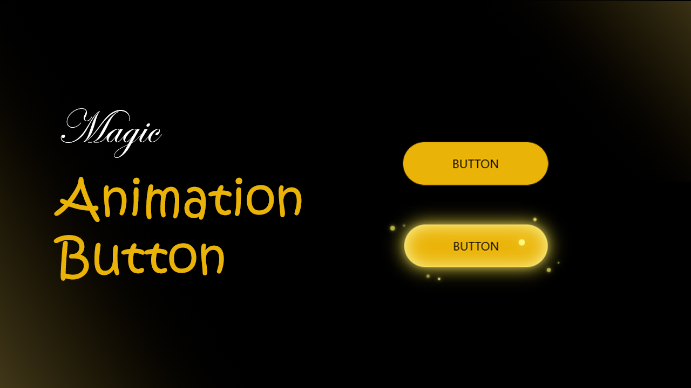

# Animation-Button

Button with Hover Effect
This is a simple project showcasing how to create an interactive button with a hover effect using HTML and CSS and js.

# Features:
A visually appealing button with smooth hover animation.
Fully responsive and customizable.
Easy to integrate into any web project.

index.html: The main HTML file containing the button structure.
style.css: The CSS file defining the button's appearance and hover effec
javascript.js : Contains the structure of button and mouse animations

Tutorial Video:
For a step-by-step guide on how to build this project, check out my YouTube tutorial:
Watch the Tutorial

Contributing:
If you have any suggestions or improvements, feel free to open an issue or submit a pull request.

License:
This project is licensed under the MIT License. See the LICENSE file for more details.
